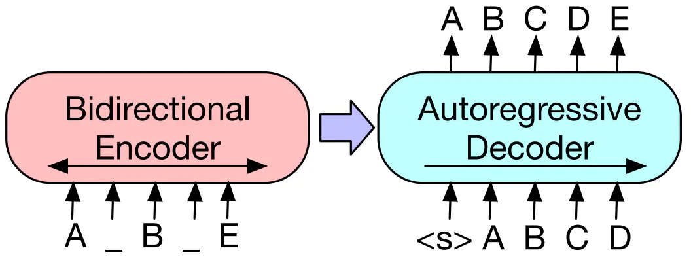
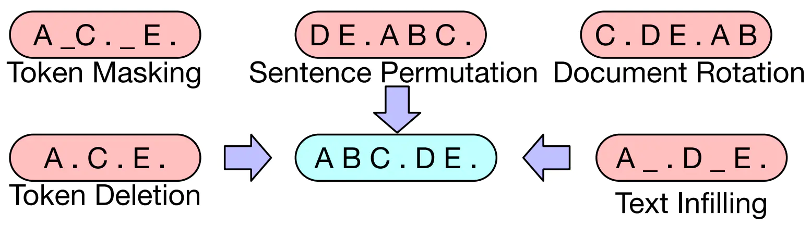
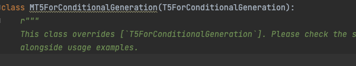
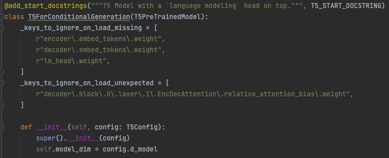
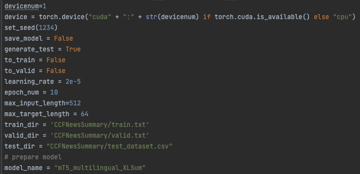

 

# 新闻摘要生成


## 参考资料

赛题来自[DataFountain比赛官网链接](https://www.datafountain.cn/competitions/541)

### 模型和预训练参数

mt5模型的实现来自[huggingface的transformers库](https://github.com/huggingface/transformers)

[预训练模型参数](https://huggingface.co/csebuetnlp/mT5_multilingual_XLSum)经过在包含45种语言的[XL-Sum](https://huggingface.co/datasets/csebuetnlp/xlsum)数据集上预训练得到

### 代码编写

加载transformers库中mt5预训练模型进行测试，参考博客[稀土掘金baseline](https://juejin.cn/post/7026590075051851789)

在赛题数据集上对mt5预训练模型进行微调，参考博客[Hugging Face 的 Transformers 库快速入门（八）：文本摘要任务](https://xiaosheng.run/2022/03/29/transformers-note-8.html)

## 小组成员与分工

| 姓名 | 学号 | 分工                                        |
| ---- | ---- | ------------------------------------------- |
| 李润X  | -    | 本项目中，transformer框架                         |
| 梁XX  | -    | 本项目中，解决方案一：mt5预训练模型的调研       |
| 袁XX  | -    | 本项目解决方案一：mt5预训练模型的测试、微调 |
| 卢XX  | -    | 本项目解决方案二：2022年ACL文本摘要 SOTA 方法BRIO |
| 李子X  | -    | discussion中，“MRC介绍”部分                   |
| 宁XX  | -    | discussion中，“VQA介绍”部分                   |
| 叶XX  | -    | discussion中，“用MRC的思路实现VQA”部分        |


## 问题描述

依据真实的新闻文章，利用机器学习相关技术，建立高效的摘要生成模型，为新闻文档生成相应的内容摘要。

## 技术方案介绍

> 写方法介绍，不涉及具体代码

### 模型

#### 1. mt5

（todo lwj）

#### 2. BRIO

BRIO 全称为 Bringing Order to Abstractive Summarization，该文章发表于 ACL2022。它在 CNN/Daily Mail 数据集上在基于预训练模型 BART 的情况下，修改了更加贴近于评估指标 ROUGE-L 的 loss 函数，获得了当时的 SOTA 成果。

##### a. BART

BART是一个用来预训练 seq2seq 模型的去噪自编码器。它通过在输入序列中加入随机的噪声函数，并利用 seq2seq 结构从损坏的文本中重构原始文本来训练模型。BART运用了基于 Transformer 的机器翻译结构，可以看作是 BERT（encoder 结构）和 GPT（decoder 结构）的结合体。其中，随机改变原始序列的顺序和将 text spans 替换为一个单独的 mask token 的填充模式具有较好的表现，该方法使得模型去推理总的句子长度并对输入进行更长范围的转变，来泛化 BERT 的原始 word masking 和 next sentence prediction 任务。BART不仅可以在 text generation 任务上微调，同时也适用于其他下游任务。

BART是一个seq2seq的模型结构，有一个双向的 encoder（用来处理含噪声的文本）和一个自回归的 decoder。对于 base 模型，有 6 层 encoder layer 和 6 层 decoder layer； 对于 large 模型，encoder 和 decoder 各有 12 层。与 BERT 模型相比，（1）BART 每一层 decoder layer 都与 encoder 的最后一层隐藏层进行 cross attention。（2）BART 在预测之前不再接一个全连接层。总体上，BART 比 BERT 多出约 10% 的参数。下图为BART模型结构。



<center> BART 模型结构 </center>

BART 在 corrupted 文本上进行训练，损失为 decoder 的预测输出与原始文本之间的交叉熵损失。BART 允许任何形式的文本破坏，在所有信息都丢失的极端情况下，就相当于一个语言模型。下面是BART使用到的一些形式：

**Token Masking** 随机采样一些 tokens 被将它们替换为 [MASK]

**Token Deletion** 随机删除 tokens

**Text Infilling** 抽样一些 text spans 替换为单一的 [MASK] token, span 长度符合 Poisson 分布（$\lambda=3$）。长度为 0 的 span 相当于插入一个 [MASK]。该任务能让模型学习到在一个 span 中有多少 token 丢失。

**Setence Permuation** 一个文档根据句号分为多个句子，随机的改变句子顺序

**Document Rotation** 随机的抽取一个 token，将该 token 移到文档的开头。该任务能让模型学会分辨文档的开头。



<center> 噪声形式 </center>

而在接下来的 FIne-tuning 过程中做摘要，encoder 输入为原始文本，decoder 输出对应的文本。

##### b. 损失函数

在 BRIO 这个架构中，损失函数是一大创新。

正常来说，一般会使用的损失函数有交叉熵函数：


$$
L_{xent} = -\sum_{j=1}^l \sum_s p_{true}(s|D, S_{\lt j}^r) \log p_{g_\theta} (s|D, S_{\lt j}^r; \theta)
$$


也会用 label smoothing 软标签的做法：


$$
p_{true}(s|D, S_{\lt j}^r) = \begin{cases}
1 - \beta, &s=s_j^r \\
\frac{\beta}{N-1}, &s \not= s_j^r
\end{cases}
$$


通过上述训练方式，模型 $g$ 在预测阶段，采用自回归（autoregressive）产生候选摘要序列，因例举出所有可能的候选结果是很困难的，因此在实践中使用 beam search 减少搜索空间，其中搜索中最重要的就是根据前面预测的序列，来估计下一个 token 出现的概率，即：


$$
p_{g_\theta} (s_t|D, S_{\lt j}; \theta)
$$


上式与交叉熵函数最大的不同模型在预测下一个 token 时，用的是之前预测的序列 $S_{\lt j}$ 代替参考序列 $S_{\lt j}^{r}$，这就导致出现 exposure bias 问题：即使模型 $g$ 训练拟合的很好，一但在预测过程中 $S_{\lt j}$ 出现偏移，跟 $S_{\lt j}^{r}$ 不一致，模型预测的性能就会衰退、下降的问题。

摘要抽取模型 $g$ 应该具备给更好的候选摘要序列分配更高的概率，然而在 MLE 训练方式下，是达不到的。其反例就是：当一个模型获得 MLE loss 为 0 的时候，那应该在推测时，跟参考序列不一样的候选序列的概率应该都为 0，然后实际中是不存在的(因为 exposure bias 的存在)。

因此，候选摘要出现的概率应该与它们的一个自动度量指标 M 密切相关。虽无法例举可能生成的所有候选摘要，然只需要能对产生的最可能的候选摘要（如来自 beam search）进行准确的排序就可以。

为此，论文为达到上述想法，将 label smoothing 的软标签做法公式进行了微调，实现候选序列的排序，即为：


$$
\begin{cases}
p_{true^†}(S|D) = 1 - \beta, &S = S^{r} \\
\sum_{S \in \mathcal{S}} p_{true^†}(S|D) = \beta, &S \not= S^{r} \\
p_{true^†}(S_i|D) > p_{true^†}(S_j|D), &\forall S_i, S_j \in \mathcal{\hat{S}}, M(S_i) > M(S_j)
\end{cases}
$$


其意思，按照 label  smoothing 的思想给每候选序列赋予一个概率值，且两个序列的概率值大小与其在评价指标 M 下是一致的，而 BRIO 采用 ROUGE 作为 M 评价指标的一种形式，来评估候选摘要与参考摘要相似分数。这样有了对生成的候选摘要进行排序的方法与目标，那怎么训练模型也朝这个方向优化或者说受益。为接近这个问题，论文引入对比损失，将排序后的候选摘要形成对比样本，参与目标优化，即为：


$$
L_{ctr} = \sum_i \sum_{j>i} \max(0, f(S_j) - f(S_i) + \lambda_{ij})
$$

$$
f(S) = \frac{\sum_{t=1}^l \log p_{g_\theta} (s_t|D, S_{\lt j}; \theta)}{|S|^\alpha}
$$


其中 $f(S_i)$ 为长度正则化的解码概率， $L_{ctr}$ 为对比损失， i,j 为候选摘要排序后的索引，越小意味越好；即当 $j>i$ 时，$ ROUGE(S_i,S^{r}) > ROUGE(S_j,S^{r}) $。其中 $\lambda_{ij} = (j-i) * \lambda$，为排名次数的边际调整参数。

最后，论文就将文本摘要抽取任务变成一个多任务学习框架，即：


$$
L_{mul} = L_{xent} + \gamma L_{ctr}
$$


### 框架

#### 1. transformers

Transformers 提供了数以千计的预训练模型，包括本项目的文本摘要任务，提供了便于快速下载和使用的API，可以将预训练模型用在本项目给定的以CNN 和Daily Mail的报刊新闻为文章基础的数据集上微调，且模型文件可单独使用，方便魔改和快速实验。

在本项目中，直接使用 Transformers 库自带的 MT5ForConditionalGeneration类来构建模型，并加载预训练模型：
```python 
from transformers import AutoModelForSeq2SeqLM
model_name = "mT5_multilingual_XLSum"
model = MT5ForConditionalGeneration.from_pretrained(model_name)
```

本项目使用的Transformers库的类图如下：


## 技术方案实现

> 简单介绍一下代码即可，例如主要的API分别实现了什么功能

### 1. mt5
#### a.模型
使用了huggingface的代码框架，并进行了本地化方便修改模型module



#### b.数据准备
class NewsDataset(Dataset):加载训练数据

class NewsevalDataset(Dataset):加载测试数据

class DataCollator：训练数据collator. 
该过程中对文本内容进行了EDA增强：以0.1的概率进行同义词替换；以0.1的概率进行随机删减

class DataevalCollator:测试数据collator

#### c.训练代码
demo.py：主文件

def train_loop：训练单个epoch

def test_loop：验证单个epoch

def data_eval：生成测试集对应的摘要内容。 
采用beamsearch进行解码，num_beams=5

#### d.超参数设置


#### e.硬件环境
GeForce RTX 3090 单卡训练


### 2. BRIO

#### a. 代码

- `cal_rouge.py` -> 计算 ROUGE
- `config.py` -> 模型参数设置
- `data_utils.py` -> dataloader
- `label_smoothing_loss.py` -> label smoothing loss
- `main.py` -> 训练和评估过程
- `model.py` -> 模型
- `modeling_bart.py`, `modeling_pegasus.py` -> 从 Transformers 库中修改出来以支持更有效率的训练
- `preprocess.py` -> 数据预处理
- `utils.py` -> 一些杂七杂八的函数
- `gen_candidate.py` -> 生成候选摘要
- `inference.py` -> 利用 Transformers 库中预训练的 BRIO 模型生成摘要
- `test.py` -> 对于 `inference.py` 中生成的摘要进行数据的格式修正

#### b. 超参数

```python
args.batch_size = getattr(args, 'batch_size', 1)
args.epoch = getattr(args, 'epoch', 100)
args.report_freq = getattr(args, "report_freq", 100)
args.accumulate_step = getattr(args, "accumulate_step", 8)
args.margin = getattr(args, "margin", 0.001)
args.gold_margin = getattr(args, "gold_margin", 0)
args.gold_weight = getattr(args, "gold_weight", 0)
args.mle_weight = getattr(args, "mle_weight", 0.1)
args.rank_weight = getattr(args, "rank_weight", 10)
args.model_type = getattr(args, "model_type", "facebook/bart-large-cnn")
args.warmup_steps = getattr(args, "warmup_steps", 10000)
args.normalize = getattr(args, "normalize", True)
args.grad_norm = getattr(args, "grad_norm", 0)
args.seed = getattr(args, "seed", 970903)
args.no_gold = getattr(args, "no_gold", False)
args.pretrained = getattr(args, "pretrained", None)
args.max_lr = getattr(args, "max_lr", 2e-3)
args.scale = getattr(args, "scale", 1)
args.score_mode = getattr(args, "score_mode", "log")
args.datatype = getattr(args, "datatype", "diverse")
args.dataset = getattr(args, "dataset", "cnndm")
args.max_len = getattr(args, "max_len", 120)
args.max_num = getattr(args, "max_num", 16)
args.smooth = getattr(args, "smooth", 0.1)
args.total_len = getattr(args, "total_len", 1024)
args.length_penalty = getattr(args, "length_penalty", 2.0)
args.do_sample = getattr(args, "do_sample", True)
args.gen_max_len = getattr(args, "gen_max_len", 140)
args.gen_min_len = getattr(args, "gen_min_len", 55)
args.is_pegasus = getattr(args, "is_pegasus", False)
args.adding = getattr(args, "adding", 0)
args.eval_interval = getattr(args, "eval_interval", 1000)
args.num_beams = getattr(args, "num_beams", 4)
```


## 性能测试

### 数据集说明

数据是以CNN 和Daily Mail的报刊新闻为文章基础的，包含新闻文章和摘要等，该类数据集被广泛应用于摘要生成和阅读理解等应用场景。

数据文件夹包含4个文件，依次为：

| 文件类别 | 文件名         | 文件内容                    |
| -------- | -------------- | --------------------------- |
| 训练集   | train.csv      | 训练数据集，对应的摘要      |
| 测试集   | test.csv       | 测试数据集，无对应的摘要    |
| 提交样例 | submission.csv | 仅有两个字段Index \t Target |

### 评价指标

对于文本摘要任务，常用评估指标是 [ROUGE 值](https://en.wikipedia.org/wiki/ROUGE_(metric)) (short for Recall-Oriented Understudy for Gisting Evaluation)，它可以度量两个词语序列之间的词语重合率。ROUGE 值的召回率表示参考摘要在多大程度上被生成摘要覆盖，如果我们只比较词语，那么召回率就是：


准确率则表示生成的摘要中有多少词语与参考摘要相关：


最后再基于准确率和召回率来计算 F1 值。

ROUGE-1 度量 uni-grams 的重合情况，ROUGE-2 度量 bi-grams 的重合情况，而 ROUGE-L 则通过在生成摘要和参考摘要中寻找最长公共子串来度量最长的单词匹配序列。实际操作中，我们可以通过 [rouge 库](https://github.com/pltrdy/rouge)来方便地计算这些 ROUGE 值。

---

本赛题采用ROUGE-L值进行评价，详细评分算法如下：


其中 $\operatorname{LCS}(X, Y)$ 是 $X$ 和 $Y$ 的最长公共子序列的长度， $m$ 和 $n$ 分别表示人工标注摘要和机器自动摘要的长度（一般就是所含词的个数）， $R_{lcs}$ 和 $P_{lcs}$ 分别表示召回率和准确率， $F_{lcs}$ 表示ROUGE-L。

### 实验结果

将**预训练模型**和**微调后模型**进行性能对比：

|                     | ROUGE-L |
| ------------------- | ------- |
| 预训练模型          | 22.54   |
| mt5微调后模型       | 29.68   |
| mt5微调+EDA数据增强 | 30.83   |
| BRIO                | 39.96   |

mt5微调+EDA数据增强：


## Readme

### 环境配置

```sh
// 安装依赖
pip install -r requirements.txt  
// 下载预训练模型参数
git lfs install
git lfs pull
```

### 启动训练

测试mt5预训练模型在赛题数据集上的效果：

```
python main.py
```

对mt5预训练模型进行微调，拆分train_dataset.csv中的9000条数据，其中8500条用于train，500条用于valid：

```sh
python demo.py
```
